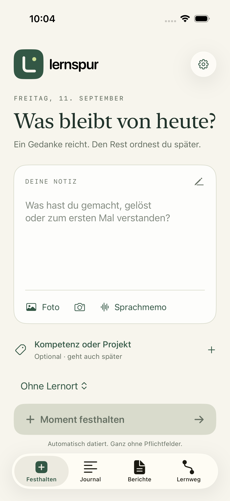
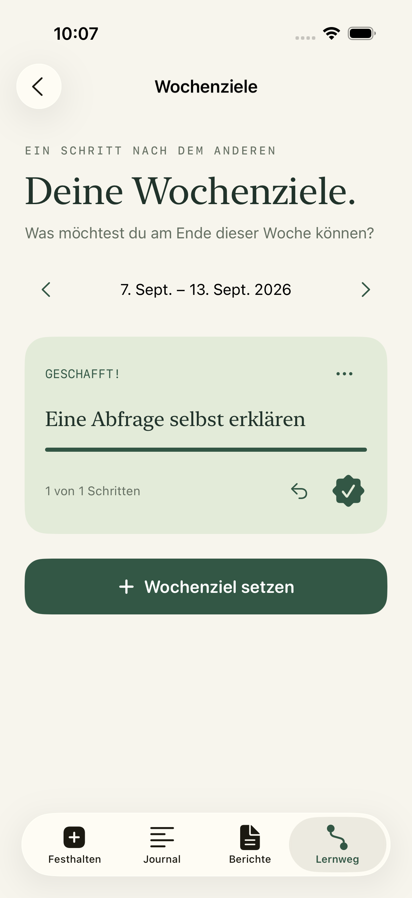
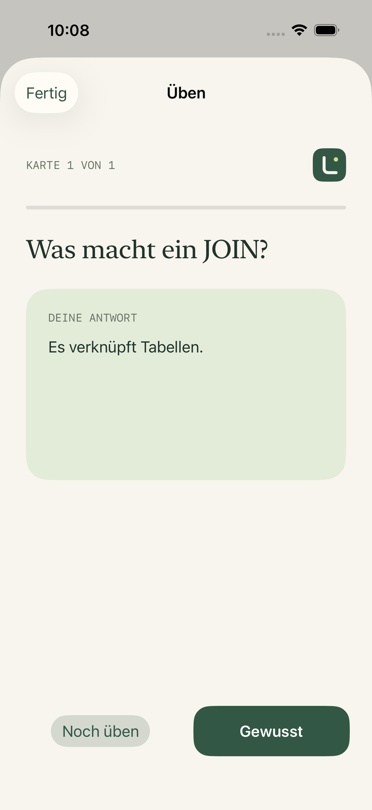

<p align="center"></p>
<h1 align="center">Lernspur</h1>
<p align="center"><strong>Lernen passiert. Überall.</strong><br>Dein Lernjournal fürs iPhone. Für die kleinen Aha-Momente im Betrieb, in der Schule und im ÜK.</p>
<p align="center"><a href="https://platret.github.io/lernspur-preview/">Website entdecken</a> · <a href="https://platret.github.io/lernspur-preview/walkthrough.html">Interaktive Basis-Demo</a> · <a href="https://platret.github.io/lernspur-preview/native.html">Native App ansehen</a></p>

---

## Ein Gedanke reicht

Eine Notiz, ein Foto oder eine Sprachmemo: Lernspur beginnt beim Festhalten. Zuordnen kannst du später. Aus deinen alltäglichen Momenten werden Wochenrückblicke, praktische Fortschritte und Lernberichte nach IPERKA.

Lernspur **1.2.1** ist eine native SwiftUI-Testversion mit lokalem SQLite-Speicher. Kein Account, kein Backend und keine aktive KI-Verarbeitung. Dieses Repository enthält die **Promo-Website, Browser-Demo und illustrative App-Aufnahmen**. Das Xcode-Projekt wird separat gepflegt und ist hier nicht enthalten.

<p align="center">
  
  
  
</p>
<p align="center"><sub>Echte Simulator-Aufnahmen mit fiktiven Testinhalten.</sub></p>

## Was die App kann

| Free – lokal auf deinem Gerät | Plus – aktuell kostenlose Testaktivierung |
| --- | --- |
| Text, Foto und Sprachmemo schnell festhalten | Eigene Fragen und Antworten als Lernkarten |
| Module, ÜKs, Projekte und optionale Kompetenzen | Karten einem Modul zuordnen und filtern |
| Wochenziele mit Schritten und Rückgängig-Funktion | Antworten aufdecken, nach rechts («Gewusst») oder links («Noch üben») wischen |
| Wochenrückblicke, offene Fragen und Lernfortschritt | Karten nach gespeichertem Lernstand wiederholen |
| Sechs IPERKA-Abschnitte und nativer PDF-Export | Geplant: Cloud-Synchronisation und KI-Zusammenfassungen |
| Homescreen-Widget, Teilen-Erweiterung und manuelle Backups | Geplanter Preis: CHF 10 / Monat |

**Plus ist noch kein echtes Abo.** Der Test-Button aktiviert lokale Vorteile kostenlos. Es erfolgen keine Käufe oder Abbuchungen. Cloud und KI sind nicht verbunden.

Die App wird derzeit mit Xcode auf Testgeräten installiert. Sie ist noch nicht im App Store oder bei TestFlight. Offizielle Bildungsplan-Kompetenzen werden nicht erfunden: die enthaltenen Codes sind ausdrücklich als DEMO-Platzhalter markiert. Persönliche Module und lizenzierte Importe sind möglich.

## Drei Wege, Lernspur zu entdecken

- **[Promo](https://platret.github.io/lernspur-preview/):** Ein räumliches iPhone dreht sich beim Scrollen. Vier Kapitel führen durch den Lernalltag; auf dem Handy lassen sie sich seitlich wischen. Eine Einstellung für reduzierte Bewegung wird respektiert.
- **[Basis-Demo](https://platret.github.io/lernspur-preview/walkthrough.html):** Anklickbare Grundfunktionen aus Version 1.0: erfassen, zuordnen, filtern und einen Bericht schreiben. Eigene Eingaben bleiben separat im Browser. Die neuen nativen Funktionen werden in der Galerie gezeigt.
- **[App-Galerie](https://platret.github.io/lernspur-preview/native.html):** Aktuelle SwiftUI-Screenshots und ein [echtes Beispiel-PDF](https://platret.github.io/lernspur-preview/native/beispiel-lernbericht.pdf) aus dem nativen Exporter.

Die Website läuft auf GitHub Pages und funktioniert auch, wenn der Entwicklungs-Mac ausgeschaltet ist.

## Website entwickeln

Voraussetzung: Node.js 22.12+ und npm.

```sh
cd site
npm ci
npm run dev
```

Öffne `http://localhost:5187`. Die Website verwendet TypeScript, CSS und Vite ohne UI-Framework, externe Fonts, Tracker oder 3D-Bibliothek. Das Phone-Modell besteht aus CSS-Flächen mit Perspektive und Tiefe. Seine Drehung folgt dem Scrollfortschritt. Die burgunderrote Konzept-Rückseite hat ein erhöhtes Kameraplateau und Linsen mit eigener Tiefe. «Get the app» ist bis zur Veröffentlichung ein deaktivierter App-Store-Platzhalter.

```text
site/
├── index.html            Promo-Einstieg
├── walkthrough.html      Einstieg der Basis-Demo
├── src/
│   ├── main.ts           Promo-Inhalte und Scroll-Interaktionen
│   ├── style.css         Layout, Phone-Modell und Responsive Styles
│   ├── demo.ts           Lokale interaktive Basis-Demo
│   └── demo.css          Gestaltung der Basis-Demo
├── public/
│   ├── screens/          Aktuelle App-Aufnahmen
│   ├── native/           Bestehende Screens und Beispiel-PDF
│   └── native.html       Galerie
└── tests/                Browser-Journeys für Promo und Demo
```

### Prüfen

```sh
cd site
npm run build
npx playwright install chromium webkit
# In einem zweiten Terminal, während npm run dev läuft:
npx playwright test
```

Der Build prüft TypeScript strikt. Die Browser-Journeys laufen in Desktop-Chromium und iPhone-WebKit: Rotation, Kapitel-Navigation, reduzierte Bewegung, Galerie, lokale Erfassung, Filter und Berichte.

### Veröffentlichen

GitHub Pages veröffentlicht `main` aus dem Repository-Stammverzeichnis. Der Quellcode liegt in `site/`; die gebauten Seiten liegen im Stammverzeichnis.

```sh
cd site
npm ci
npm run build
cp -R dist/. ../
cd ..
git add index.html walkthrough.html native.html assets screens native logo.svg app-icon.png site README.md .nojekyll
git commit -m "Update Lernspur website"
git push origin main
```

Relative Asset-Pfade erhalten die Funktionsfähigkeit unter `/lernspur-preview/`. `.nojekyll` bleibt erhalten. Änderungen zuerst lokal prüfen; keine privaten Journale, Backups, Signierungsdaten oder Provisioning-Profile veröffentlichen.
