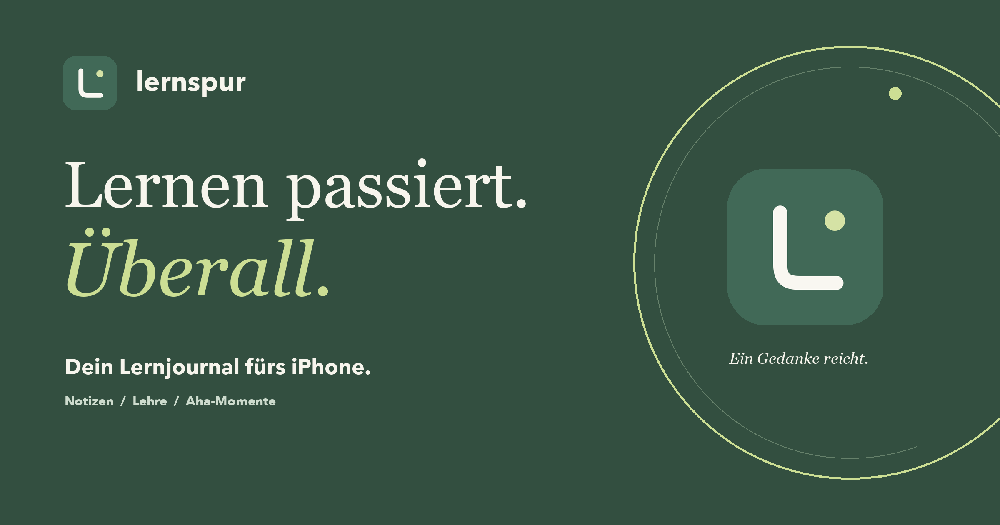

<p align="center"></p>
<h1 align="center">Lernspur</h1>
<p align="center"><strong>Lernen passiert. Überall.</strong><br>Dein Lernjournal fürs iPhone. Für die kleinen Aha-Momente im Betrieb, in der Schule und im ÜK.</p>
<p align="center"><a href="https://platret.github.io/lernspur-preview/">Website entdecken</a> · <a href="https://platret.github.io/lernspur-preview/release.html">Version 1.0 ansehen</a> · <a href="https://platret.github.io/lernspur-preview/support.html">Hilfe & Kontakt</a></p>

---

## Ein Gedanke reicht

Eine Notiz, ein Foto oder eine Sprachmemo: Lernspur beginnt beim Festhalten. Zuordnen kannst du später. Aus deinen alltäglichen Momenten werden Wochenrückblicke, praktische Fortschritte und Lernberichte nach IPERKA.

Lernspur **1.0 (7)** wird für die erste App-Store-Veröffentlichung vorbereitet. Die native SwiftUI-App speichert dein Journal lokal in SQLite. Du kannst das Onboarding manuell oder optional mit Apple durchlaufen. Das Xcode-Projekt wird separat gepflegt und ist hier nicht enthalten.



## Was die App kann

| Free – lokal auf deinem Gerät | Plus – optionales Monatsabo |
| --- | --- |
| Text, Foto und Sprachmemo schnell festhalten | Eigene Lernkarten erstellen |
| Eigene Module, ÜKs, Projekte und Kompetenzen | Nach Modul oder Fach üben |
| Wochenziele, Rückblicke und offene Fragen | Antworten aufdecken und nach links/rechts wischen |
| Lernberichte nach IPERKA und PDF-Export | Lernstand speichern, offene Karten zuerst |
| Widget, Teilen-Erweiterung und manuelle Backups | Kauf und Wiederherstellung über Apple |

Die Testfreischaltung ist im Release entfernt. Plus verwendet StoreKit 2 und verifizierte Kaufberechtigungen. Cloud-Synchronisation und KI sind nicht enthalten. Neue Installationen starten ohne Demo-Kompetenzen; eigene Kompetenzen und zur Nutzung freigegebene Modullisten können ergänzt werden.

**Noch nicht im App Store veröffentlicht.** Der StoreKit-Code ist lokal getestet; die reale App-Store-Produktkonfiguration und Apples Freigabe stehen noch aus. Der Download-Badge bleibt deshalb deaktiviert, bis eine echte Store-Adresse verfügbar ist.

## Auf deinem iPhone ansehen

- **[Promo](https://platret.github.io/lernspur-preview/):** Drehbares 3D-Telefon und seitlich wischbare Feature-Kapitel.
- **[Release-Vorschau](https://platret.github.io/lernspur-preview/release.html):** Sechs koordinierte Store-Motive aus echten nativen Aufnahmen, Beschreibung und Banner.
- **[Datenschutz](https://platret.github.io/lernspur-preview/privacy.html)** und **[Support](https://platret.github.io/lernspur-preview/support.html)**.

Die Website läuft auf GitHub Pages und funktioniert auch, wenn der Entwicklungs-Mac ausgeschaltet ist. Die früheren Browser-Prototypen bleiben im Repository als Entwicklungshistorie erhalten; sie sind nicht die aktuelle native App.

## Store-Artwork

`store/screenshots/` enthält sechs RGB-PNGs mit 1320 × 2868 Pixeln. Die Screenshots zeigen die tatsächliche native Oberfläche mit eigens angelegten Beispielinhalten. `store/banner.png` ist für Website und Social Sharing gestaltet; die Standard-App-Store-Seite bietet keinen beliebigen Website-Bannerplatz.

## Website entwickeln

Voraussetzung: Node.js 22.12+ und npm.

```sh
cd site
npm ci
npm run dev
```

Öffne `http://localhost:5187`. Die Website verwendet TypeScript, CSS und Vite ohne UI-Framework, externe Fonts, Tracker oder 3D-Bibliothek. Das Phone-Modell besteht aus CSS-Flächen mit Perspektive und Tiefe. Seine Drehung folgt dem Scrollfortschritt. Die burgunderrote Konzept-Rückseite hat ein separates Glaspanel mit Lernspur-Monogramm. Kameraplateau, Linsen und Gehäuse besitzen geschlossene Seitenflächen, damit sie auch bei 90° und 270° nicht durchsichtig werden. Die Seiten werden in `src/phone-geometry.ts` erzeugt. «Get the app» bleibt bis zur Veröffentlichung deaktiviert; der Hinweis «bald verfügbar» steht ausserhalb des unveränderten offiziellen App-Store-Badges.

```text
site/
├── index.html            Promo-Einstieg
├── walkthrough.html      Einstieg der Basis-Demo
├── src/
│   ├── main.ts           Promo-Inhalte und Scroll-Interaktionen
│   ├── style.css         Layout, Phone-Modell und Responsive Styles
│   ├── demo.ts           Lokale interaktive Basis-Demo
│   └── demo.css          Gestaltung der Basis-Demo
├── public/
│   ├── screens/          Aktuelle App-Aufnahmen
│   ├── native/           Bestehende Screens und Beispiel-PDF
│   └── native.html       Galerie
└── tests/                Browser-Journeys für Promo und Demo
```

### Prüfen

```sh
cd site
npm run build
npx playwright install chromium webkit
# In einem zweiten Terminal, während npm run dev läuft:
npx playwright test
```

Der Build prüft TypeScript strikt. Die Browser-Journeys laufen in Desktop-Chromium und iPhone-WebKit: Rotation, Kapitel-Navigation, reduzierte Bewegung, Galerie, lokale Erfassung, Filter und Berichte.

### Veröffentlichen

GitHub Pages veröffentlicht `main` aus dem Repository-Stammverzeichnis. Der Quellcode liegt in `site/`; die gebauten Seiten liegen im Stammverzeichnis.

```sh
cd site
npm ci
npm run build
cp -R dist/. ../
cd ..
git add index.html walkthrough.html native.html assets screens native logo.svg app-icon.png site README.md .nojekyll
git commit -m "Update Lernspur website"
git push origin main
```

Relative Asset-Pfade erhalten die Funktionsfähigkeit unter `/lernspur-preview/`. `.nojekyll` bleibt erhalten. Änderungen zuerst lokal prüfen; keine privaten Journale, Backups, Signierungsdaten oder Provisioning-Profile veröffentlichen.

### App-Store-Artwork

`public/vendor/app-store-badge.svg` ist unverändertes Apple-Artwork, direkt von [Apple Developer](https://developer.apple.com/assets/elements/badges/download-on-the-app-store.svg) bezogen. Quelle und Nutzungshinweise: [Apple Marketing Resources](https://developer.apple.com/app-store/marketing/guidelines/). Das Badge wird separat vom Verfügbarkeitshinweis angezeigt; es führt bis zum Release zu keiner Store-Seite. Apple behält die Rechte an diesem Artwork.
